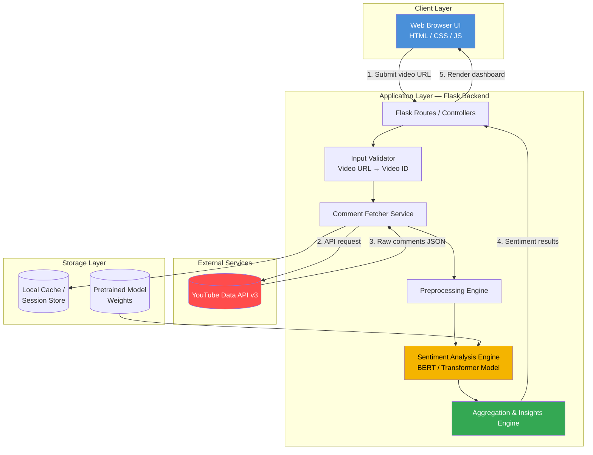
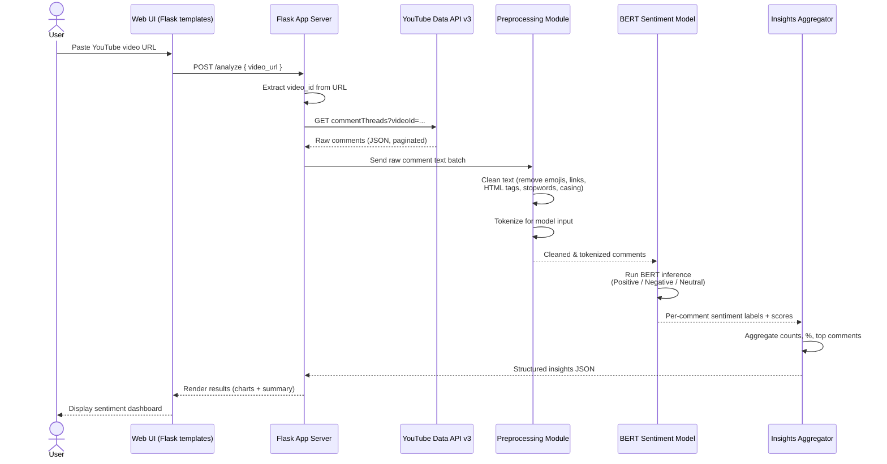

# 🎯 Intelligent YouTube Comment Analyzer

> Uncover the true pulse of your audience. A web-based tool that applies deep learning (Transformer/BERT-based NLP) to YouTube comments, delivering actionable sentiment insights that help creators and marketers improve audience engagement.


---

## 📖 Table of Contents

- [Problem Statement](#-problem-statement)
- [Solution Overview](#-solution-overview)
- [Key Features](#-key-features)
- [System Architecture](#-system-architecture)
- [Data Flow Diagram](#-data-flow-diagram)
- [Data Pipeline](#-data-pipeline)
- [Tech Stack](#-tech-stack)
- [Project Structure](#-project-structure)
- [Getting Started](#-getting-started)
- [Configuration](#-configuration)
- [Usage](#-usage)
- [Model Details](#-model-details)
- [Results & Insights](#-results--insights)
- [Roadmap](#-roadmap)
- [Contributing](#-contributing)
- [License](#-license)
- [Author](#-author)

---

## 🧩 Problem Statement

YouTube creators, brands, and marketers receive thousands of comments on their videos, but:

- **Manual comment reading doesn't scale.** A single popular video can generate tens of thousands of comments — impossible to read manually.
- **Raw comments hide the signal.** Sarcasm, spam, emojis, and mixed-language text make it hard to judge true audience sentiment at a glance.
- **No actionable summary exists natively.** YouTube Studio shows engagement metrics (likes, views) but gives no structured breakdown of *how the audience feels* or *what they're talking about*.
- **Delayed reaction to negative sentiment.** Without an automated way to flag negative trends early, creators/brands lose the chance to respond before backlash grows.

**Intelligent YouTube Comment Analyzer** solves this by automatically fetching, cleaning, and classifying comments using a deep learning (Transformer/BERT-based) sentiment model — turning raw, noisy comment threads into a clear positive/negative/neutral breakdown and actionable insights, all through a simple web interface.

---

## 💡 Solution Overview

1. The user pastes a **YouTube video URL** (or video ID) into the web app.
2. The backend fetches all comments for that video via the **YouTube Data API v3**.
3. Comments are **cleaned and preprocessed** (removing noise, emojis, links, stopwords, etc.).
4. A **BERT-based Transformer model** classifies each comment's sentiment (Positive / Negative / Neutral).
5. Results are **aggregated and visualized** on a dashboard — sentiment distribution, top comments, and overall audience pulse.

---

## ✨ Key Features

- 🔗 Analyze sentiment for **any public YouTube video** by URL
- 🤖 **Deep learning (BERT/Transformer)**-based sentiment classification for higher accuracy than lexicon-based methods
- 🧹 Automated **text preprocessing pipeline** (cleaning, normalization, tokenization)
- 📊 Visual sentiment breakdown (Positive / Negative / Neutral distribution)
- 🌐 Simple, responsive **Flask + HTML/CSS/JS** web interface — no installation needed for end users
- ⚡ Batch processing of large comment volumes per video
- 📁 Exportable/summarized insights for reporting

---

## 🏗️ System Architecture



**Layer breakdown:**

| Layer | Responsibility |
|---|---|
| **Client (Presentation)** | HTML/CSS/JS frontend where the user enters a video URL and views results |
| **Application (Flask)** | Routes requests, validates input, orchestrates fetching → preprocessing → inference → aggregation |
| **External Services** | YouTube Data API v3 for comment retrieval |
| **ML/NLP Engine** | Loads the pretrained BERT/Transformer model and performs inference on cleaned text |
| **Storage** | Caches fetched comments per session/video and holds the pretrained model weights |

---

## 🔄 Data Flow Diagram



---

## 🛠️ Data Pipeline

The core ML pipeline that transforms raw YouTube comments into insights:

```mermaid
flowchart LR
    A[Raw Comments<br/>YouTube Data API] --> B[Text Cleaning<br/>remove URLs, HTML, emojis]
    B --> C[Normalization<br/>lowercasing, punctuation removal]
    C --> D[Stopword Removal &<br/>Noise Filtering]
    D --> E[Tokenization<br/>BERT Tokenizer]
    E --> F[Sentiment Inference<br/>Fine-tuned Transformer Model]
    F --> G[Label Mapping<br/>Positive / Negative / Neutral]
    G --> H[Aggregation<br/>counts, ratios, trend]
    H --> I[Visualization<br/>charts + dashboard]

    style A fill:#ff4c4c,color:#fff
    style F fill:#f4b400,color:#000
    style I fill:#4a90d9,color:#fff
```



**Pipeline stages explained:**

1. **Ingestion** – Comments are pulled in pages via the YouTube Data API v3 `commentThreads.list` endpoint until all (or a capped number of) top-level comments are retrieved.
2. **Cleaning** – Strip HTML entities, URLs, emojis/emoticons, and excessive whitespace from each comment.
3. **Normalization** – Lowercase text and standardize punctuation so the model sees consistent input.
4. **Noise Filtering** – Remove empty, spam-like, or non-language comments (e.g. comments that are only emojis or links).
5. **Tokenization** – Convert cleaned text into token IDs using the Transformer's tokenizer, with padding/truncation to a fixed max sequence length.
6. **Inference** – Feed tokenized batches through the fine-tuned BERT/Transformer classification head to get a sentiment label and confidence score per comment.
7. **Aggregation** – Roll up per-comment predictions into video-level statistics: sentiment distribution (%), most positive/negative comments, and overall audience sentiment score.
8. **Presentation** – Render the aggregated results as charts/summary cards on the results page.

---

## 🧰 Tech Stack

| Category | Technology |
|---|---|
| **Backend** | Python, Flask |
| **Frontend** | HTML5, CSS3, JavaScript |
| **NLP / ML** | BERT-based Transformer model (Hugging Face `transformers` / PyTorch or TensorFlow) |
| **Data Source** | YouTube Data API v3 |
| **Data Processing** | Pandas, NumPy, Regex-based text cleaning |
| **Visualization** | Chart.js / Matplotlib (dashboard charts) |
| **Environment** | Python virtual environment (`venv`) |

> Replace/expand this table with the exact library versions from your `requirements.txt` if they differ.

---

## 📂 Project Structure

```
Intelligent-Youtube-Comment-Analyzer/
├── static/                 # CSS, JS, images
├── templates/              # HTML templates (Flask/Jinja2)
├── app.py                  # Flask entry point
├── auth.py                 # Authentication routes/helpers
├── database.py             # Firestore data access layer
├── analyses.py             # Sentiment analysis orchestration
├── Model.py                # BERT/Transformer model loading & inference
├── fetch_comments.py       # YouTube Data API comment fetching
├── extract_id.py           # Video URL → video ID extraction
├── emoji_analyzer.py       # Emoji-based sentiment helpers
├── separate_emojis_and_text.py
├── create_bar_chart.py     # Chart generation helpers
├── key_insights.py         # Insight aggregation
├── ternding_Topics.py      # Trending topics extraction
├── requirements.txt        # Python dependencies
└── README.md
```

---

## 🚀 Getting Started

### Prerequisites

- Python 3.9+
- A **Google Cloud project** with the **YouTube Data API v3** enabled
- A valid **YouTube Data API key**

### Installation

```bash
# 1. Clone the repository
git clone https://github.com/SM649/Intelligent-Youtube-Comment-Analyzer.git
cd Intelligent-Youtube-Comment-Analyzer

# 2. Create and activate a virtual environment
python -m venv venv
source venv/bin/activate      # On Windows: venv\Scripts\activate

# 3. Install dependencies
pip install -r requirements.txt

# 4. Run the app
python app.py
```

The app reads its port from the `PORT` environment variable, defaulting to `5001` when run
locally. The deployed Hugging Face Space sets `PORT=7860`.

The app will be available at `http://127.0.0.1:5001/` when run locally.

---

## ⚙️ Configuration

Create a `.env` file in the project root with your credentials:

```env
YOUTUBE_API_KEY=your_youtube_data_api_v3_key_here
FLASK_SECRET_KEY=your_flask_session_secret_key_here
FIREBASE_SERVICE_ACCOUNT_JSON={"type": "service_account", ...}
```

- `YOUTUBE_API_KEY` — a YouTube Data API v3 key.
- `FLASK_SECRET_KEY` — used to sign Flask session cookies; the app will not start without it.
- `FIREBASE_SERVICE_ACCOUNT_JSON` — the full contents of your Firebase service account JSON key,
  as a single-line JSON string; used to authenticate to Firestore. The app will not start without it.

On Hugging Face Spaces, set these as Repository Secrets instead of committing a `.env` file.

> 🔒 Never commit your `.env` file, API keys, or the Firebase service account JSON to version
> control. Both `.env` and `firebase-service-account.json` are already in `.gitignore`.

---

## ▶️ Usage

1. Launch the app (`python app.py`) and open it in your browser.
2. Paste the **YouTube video URL** you want to analyze.
3. Click **Analyze**.
4. The app fetches comments, runs them through the sentiment pipeline, and displays:
   - Overall sentiment distribution (Positive / Negative / Neutral)
   - Sample top positive and negative comments
   - Summary insight on overall audience reaction

---

## 🧠 Model Details

- **Architecture:** BERT-based Transformer sentiment classifier
- **Task:** 3-class sentiment classification (Positive / Negative / Neutral)
- **Input:** Cleaned, tokenized YouTube comment text
- **Output:** Predicted sentiment label + confidence score per comment

> 📝 Fill in specifics here: which pretrained checkpoint you fine-tuned from (e.g. `bert-base-uncased`, `distilbert-base-uncased`), the dataset used for fine-tuning, and reported accuracy/F1 score, so recruiters/reviewers can see the model's real performance.

---

## 📊 Results & Insights

> 📝 Add a short summary and/or screenshot of the dashboard here, e.g.:
> - Accuracy on validation set: `XX%`
> - Example: analyzed **X,XXX comments** from a sample video → **68% positive, 22% neutral, 10% negative**

---

## 🗺️ Roadmap

- [ ] Multi-language sentiment support
- [ ] Emotion detection (beyond positive/negative/neutral)
- [ ] Spam/bot comment filtering
- [ ] Export insights as PDF/CSV report
- [ ] Deploy live demo (Render / Heroku / Vercel)
- [ ] Add automated tests & CI pipeline

---

## 🤝 Contributing

Contributions are welcome!

1. Fork the repo
2. Create a feature branch: `git checkout -b feature/your-feature`
3. Commit your changes: `git commit -m "Add your feature"`
4. Push to the branch: `git push origin feature/your-feature`
5. Open a Pull Request

---

## 📄 License

This project is licensed under the **MIT License with Attribution Requirement** — free to use, modify, and distribute, but credit to the original author must be given wherever the project is used. See the [LICENSE](LICENSE) file for details.

---

## 👤 Author

**SM649**
Final Year Project — Intelligent YouTube Comment Analyzer

⭐ If you found this project useful, consider giving it a star on GitHub!
